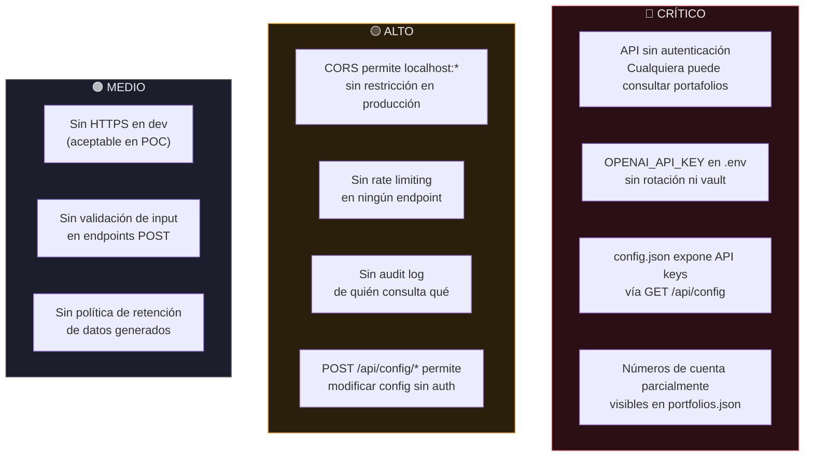
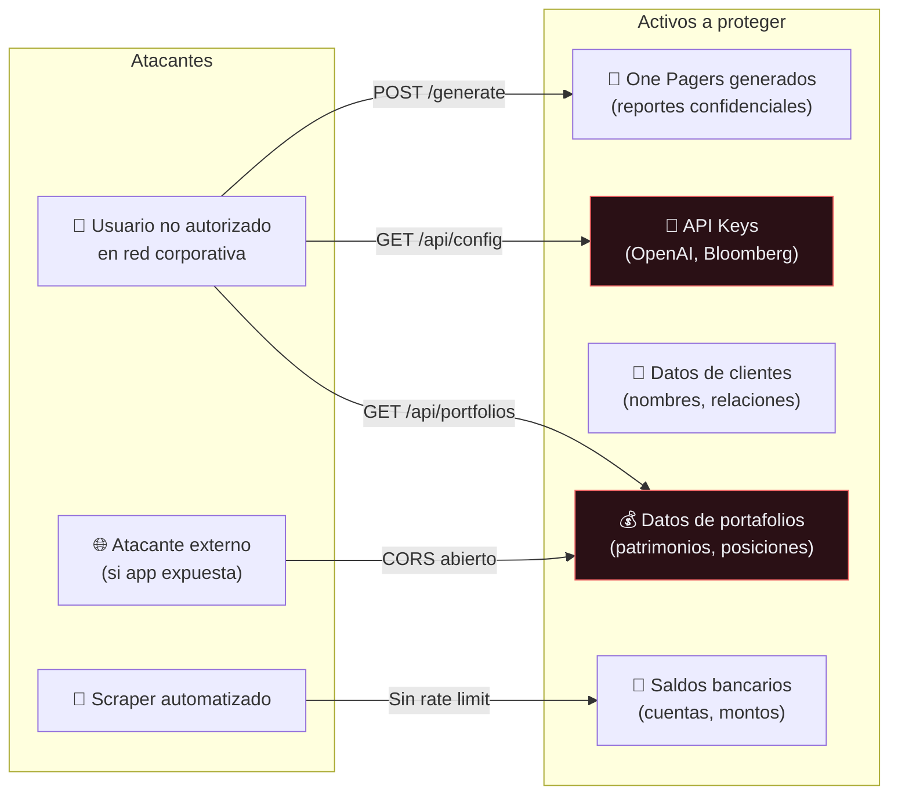
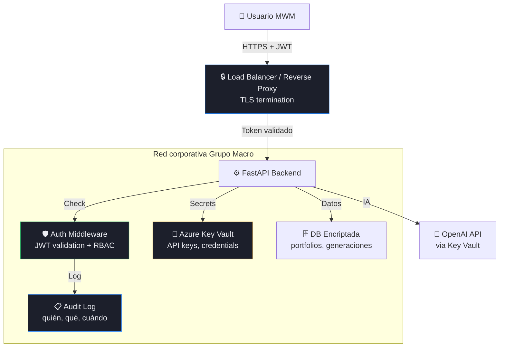

# Spec — Seguridad y Protección de Datos · S2-ONE

**POC SEIDOR IA Lab · MWM (Macro Wealth Management)**
Versión: 1.0 — 2026-04-11

---

## Por qué esto importa

S2-ONE maneja **datos financieros reales** de clientes de MWM:
- Patrimonios de US$12M–45M
- Posiciones de inversión con ISIN, cantidades y precios reales
- Saldos de caja por banco con números de cuenta
- Nombres de clientes reales (personas y empresas)

Un error de datos puede costar **US$100K** (pérdida de cliente).
Una filtración de datos puede tener **consecuencias regulatorias** (SBS Perú, SMV).

---

## Estado Actual — Vulnerabilidades Identificadas



### Detalle de vulnerabilidades críticas

| # | Vulnerabilidad | Dónde | Riesgo |
|---|---------------|-------|--------|
| V1 | **API completamente abierta** | `main.py` — todos los endpoints | Cualquier persona en la red puede ver patrimonios, clientes, posiciones |
| V2 | **API key de OpenAI en .env sin protección** | `backend/.env` | Si se filtra, costo ilimitado en API de OpenAI |
| V3 | **GET /api/config expone claves** | `main.py:279-285` | `api_key: "********"` hoy es mock, pero el patrón invita a poner claves reales |
| V4 | **Cuentas bancarias en JSON** | `portfolios.json` saldos_caja | Números parcialmente enmascarados pero estructura real expuesta |
| V5 | **CORS abierto** | `main.py:24-29` | En producción permitiría requests desde cualquier origen |
| V6 | **Sin rate limiting** | Todos los endpoints | Permite scraping masivo de datos financieros |
| V7 | **Sin auditoría** | Global | No hay registro de quién consultó qué portafolio ni cuándo |
| V8 | **Config mutable sin auth** | `POST /api/config/*` | Cualquiera puede cambiar configuración de integraciones |

---

## Modelo de Amenazas



---

## Plan de Seguridad — 3 Fases

### Fase 1: POC / Hackathon (mínimo viable)

Objetivo: **no exponer datos reales innecesariamente** sin frenar la demo.

| Medida | Qué hacer | Impacto | Esfuerzo |
|--------|----------|---------|----------|
| **Auth básica por token** | Header `Authorization: Bearer <token>` en todos los endpoints. Token estático en `.env`. Frontend lo envía en cada request. | Bloquea acceso casual | ~1h |
| **Ocultar /api/config** | Remover o proteger `GET /api/config` — no debe ser público. Mover a endpoint `/api/admin/config` con token separado. | Evita exposición de keys | ~30min |
| **Enmascarar cuentas** | En `portfolios.json` y en respuestas API: mostrar solo últimos 4 dígitos de cuentas bancarias. | Protege datos bancarios | ~30min |
| **CORS restringido** | Solo permitir origins explícitos (el frontend real). Eliminar wildcards. | Previene CSRF | ~15min |
| **Gitignore estricto** | Verificar que `.env`, `*.key`, `config.json` con claves reales estén en `.gitignore`. | Previene filtraciones en repo | ~10min |
| **Rate limiting básico** | `slowapi` en FastAPI: 60 req/min por IP en endpoints de lectura, 10 req/min en `/generate`. | Previene scraping | ~45min |

### Fase 2: MVP (post-hackathon)

Objetivo: **autenticación real** y **auditoría**.

| Medida | Qué hacer | Notas |
|--------|----------|-------|
| **Autenticación OAuth2 / JWT** | Integrar con el identity provider de Grupo Macro (Azure AD o similar). Cada usuario tiene token con claims de rol. | Requerido antes de datos reales |
| **Roles y permisos (RBAC)** | `gestor` → ve solo sus portafolios. `analista` → ve todos. `admin` → config. `auditor` → solo lectura + logs. | Principio de menor privilegio |
| **Audit log** | Registrar: quién, qué endpoint, qué portafolio, cuándo, desde qué IP. Tabla en DB o servicio de logs. | Requerimiento regulatorio SBS |
| **Secrets en vault** | Mover API keys (OpenAI, Bloomberg) a Azure Key Vault o similar. Nunca en archivos planos. | Rotación automática |
| **HTTPS obligatorio** | TLS en toda comunicación. Certificado en el servidor. Redirect HTTP→HTTPS. | Estándar mínimo para datos financieros |
| **Validación de input** | Pydantic models para todos los POST bodies. Rechazar payloads malformados. | Previene injection |
| **Sanitización de narrativa IA** | Validar que la narrativa generada por GPT-4o no incluya datos sensibles inesperados (prompt injection). | Riesgo de exfiltración vía LLM |

### Fase 3: Producción

Objetivo: **compliance regulatorio** completo.

| Medida | Qué hacer |
|--------|----------|
| **Encriptación at rest** | Datos de portafolios encriptados en disco/DB (AES-256). |
| **Data retention policy** | One Pagers generados se retienen X meses, luego se archivan/eliminan. Definir con Legal. |
| **Penetration testing** | Test de seguridad por tercero antes de go-live. |
| **DLP (Data Loss Prevention)** | Monitorear que datos de portafolios no salgan por canales no autorizados. |
| **Segregación de ambientes** | Dev con datos mock, staging con datos anonimizados, prod con datos reales. Nunca mezclar. |
| **Backup y recovery** | RPO/RTO definidos. Backup encriptado de configuraciones y datos generados. |
| **Compliance SBS/SMV** | Verificar requisitos regulatorios de Perú para manejo de datos de inversión. |

---

## Datos Sensibles — Clasificación

| Dato | Clasificación | Presente en | Tratamiento |
|------|--------------|-------------|-------------|
| Nombre de cliente | **CONFIDENCIAL** | `portfolios.json` → `cliente` | Enmascarar en logs; no exponer en URLs |
| Patrimonio (monto) | **CONFIDENCIAL** | `portfolios.json` → `patrimonio` | Solo visible para usuarios autorizados |
| Números de cuenta | **RESTRINGIDO** | `portfolios.json` → `saldos_caja[].cuenta` | Mostrar solo últimos 4 dígitos siempre |
| Posiciones (activos) | **CONFIDENCIAL** | `portfolios.json` → `activos[]` | Información de inversión protegida |
| API keys | **SECRETO** | `.env`, `config.json` | Nunca en código ni logs. Vault en producción. |
| One Pagers generados | **CONFIDENCIAL** | Runtime (API response) | No cachear en browser. Headers `no-store`. |
| Narrativa IA | **INTERNO** | Runtime | Puede contener inferencias sobre estrategia de inversión |
| Métricas (WTD/MTD/YTD) | **INTERNO** | Calculadas en runtime | Performance del cliente — confidencial |

---

## Arquitectura de Seguridad Target



---

## Headers de Seguridad (implementar en backend)

```python
# Middleware de seguridad recomendado para FastAPI
SECURITY_HEADERS = {
    "X-Content-Type-Options": "nosniff",
    "X-Frame-Options": "DENY",
    "X-XSS-Protection": "1; mode=block",
    "Strict-Transport-Security": "max-age=31536000; includeSubDomains",
    "Cache-Control": "no-store, no-cache, must-revalidate",  # Datos financieros NO se cachean
    "Pragma": "no-cache",
    "Content-Security-Policy": "default-src 'self'",
    "Referrer-Policy": "strict-origin-when-cross-origin",
}
```

---

## Checklist Rápido — Hackathon

Para la demo del hackathon, el **mínimo** que debería estar listo:

- [ ] Token estático en `.env` → middleware que valida `Authorization: Bearer <token>`
- [ ] `.env` y `config.json` (con claves reales) en `.gitignore`
- [ ] `GET /api/config` protegido o removido de acceso público
- [ ] Cuentas bancarias enmascaradas (solo últimos 4 dígitos en response)
- [ ] CORS solo permite el origin del frontend real
- [ ] Rate limiting básico con `slowapi`
- [ ] Disclaimer visible en la UI: "POC — Datos de prueba — No usar para decisiones de inversión"

---

## Decisiones Pendientes (para MWM)

Estas preguntas deben responderse con el equipo de Grupo Macro antes de pasar a MVP:

1. **¿Qué identity provider usa Grupo Macro?** (Azure AD, Okta, otro) → define cómo implementar auth
2. **¿Existe política de clasificación de datos?** → alinearse con ella
3. **¿Hay requisitos regulatorios SBS para este tipo de sistema?** → puede requerir audit trail formal
4. **¿Quién puede ver qué portafolio?** → reglas de RBAC (ej: Luciano solo ve Alpha, Carlos ve todos)
5. **¿Dónde se despliega en producción?** → Azure de Grupo Macro vs Azure de SEIDOR → impacta residencia de datos
6. **¿Se necesita consentimiento del cliente final?** → si el One Pager se genera con IA, ¿el cliente debe saberlo?
